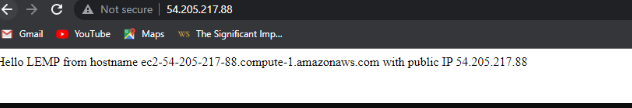
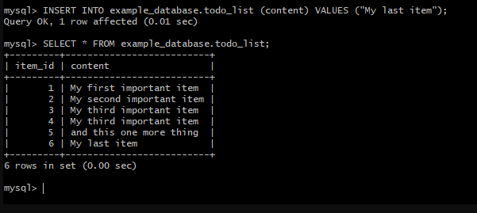

## GREAT DONE PROJECT 2

`sudo apt update`
`sudo apt install nginx`
`sudo systemctl status nginx`

`sudo mysql`
`sudo mysql_secure_installation`
`sudo mysql -p`
`sudo apt install php-fpm php-mysql`

`sudo mkdir /var/www/projectLEMP`
`sudo chown -R $USER:$USER /var/www/projectLEMP`
`sudo ln -s /etc/nginx/sites-available/projectLEMP /etc/nginx/sites-enabled/`

`sudo nginx -t`
`sudo unlink /etc/nginx/sites-enabled/default`
`sudo systemctl reload nginx`
`sudo nano /var/www/projectLEMP/info.php`
`sudo rm /var/www/your_domain/info.php`
`mysql> CREATE DATABASE example-database ;`
`mysql>  CREATE USER 'example_user'@'%' IDENTIFIED WITH mysql_native_password BY 'password';`
`mysql> GRANT ALL ON example_database.* TO 'example_user'@'%';`
`mysql -u example_user -p`
`mysql> SHOW DATABASES;`

`mysql> INSERT INTO example_database.todo_list (content) VALUES ("My first important item");`
`mysql>  SELECT * FROM example_database.todo_list;`

`nano /var/www/projectLEMP/todo_list.php`

- [Openport](curl http://localhost:80)